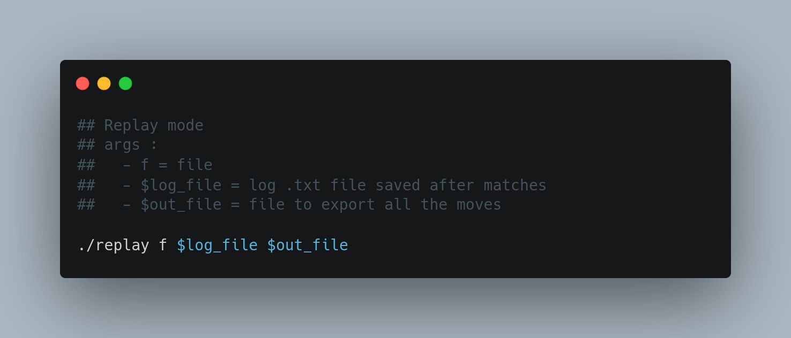
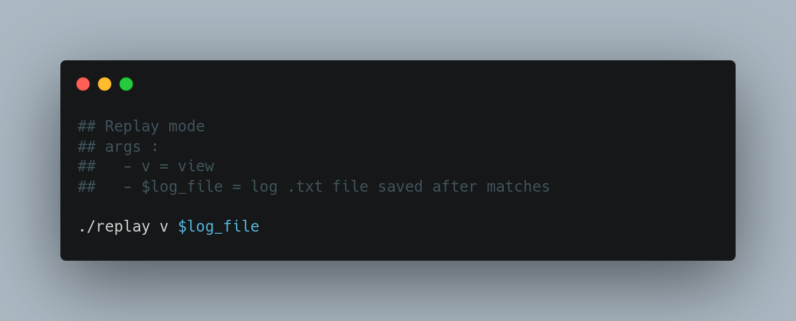

<p align="center">
	
</p>


# ChessCPP
A simple chess game made in C++ made for the programming exam at my university. 

**final result: 10/10**

## Table of Contents
- [Functionalites](#functionalities)
- [Pieces](#pieces)
- [Installation](#installation)
- [Usage](#usage)


## Functionalities
The project implements:
- A chess game with rules and special moves implemented, featuring 2 game modes
        -**Computer vs Computer**
        -**Player vs Computer**
- A **replay mode**, where logs of past matches saved in .txt file can 
        - placed inside a different .txt file with all chessboard changes
        - step by step replay of the match in the terminal

## Pieces
List of pieces (standard Italian pieces):
- **A:** Bishop
- **D:** Queen
- **R:** King
- **T:** Rook
- **C:** Knight
- **P:** Pawn


## Installation
**Note**: CMake is required!

After cloning the project, open the folder and write:
```shell 
$ cmake . 
```
Now it is necessary to create the dependencies: 
```shell 
$ make 
```

## Usage
### How to Game
First you need to select the desired game mode
<p align="center">
	
</p>

If you choose cc:
- insert the maximum rounds played by the bots
  
If you choose pc:
- insert the username

The layout of the chessboard is labeled according to the classic rules:
<p align="center">
	
</p>


>**Note:** white pieces are lower case, black pieces are upper case

To specify a move insert the start position and end position. 
The coordinates are in the format **{letter/column}{number/row}**, case insensitive.
Overall, you can:
    - Insert a move (e.g d2 d4)  
    - **FF** : ask to draw 


### Replay mode
There are 2 mode of view a replay
- Put replay in a .txt with all chessboard changes
<p align="center">
	
</p>

- Step by step replay of the match
<p align="center">
	
</p>

## Contributions
- [Markovi](https://github.com/Markovii00)
- [Alessandro Viespoli](https://github.com/zincalex)
- [Francesco Colla](https://github.com/thelion154)


